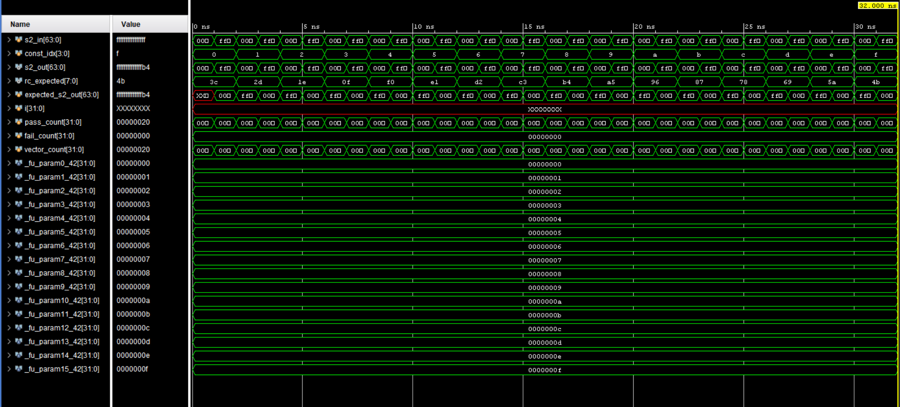
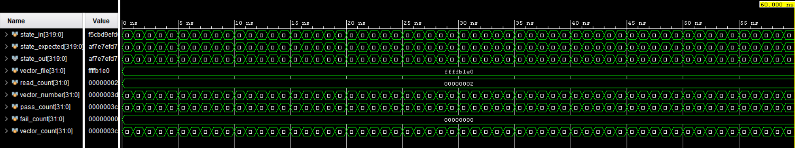
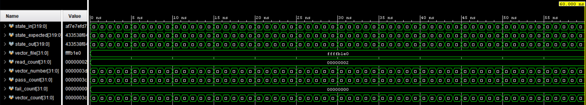
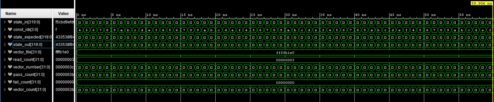
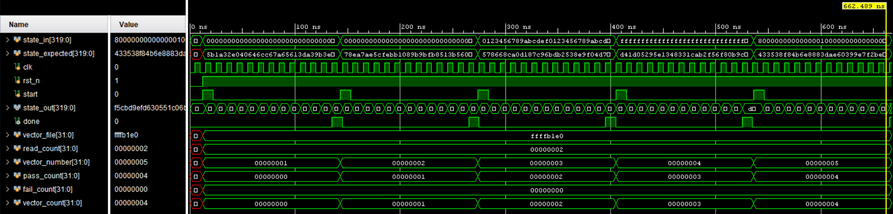
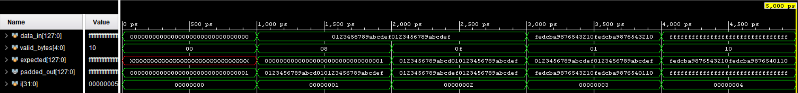
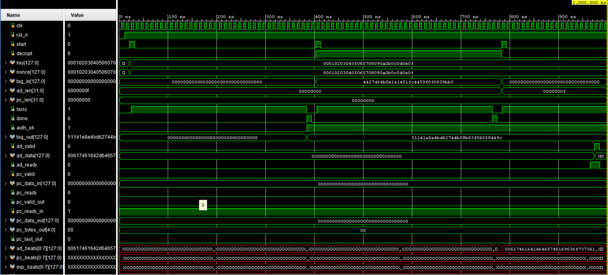
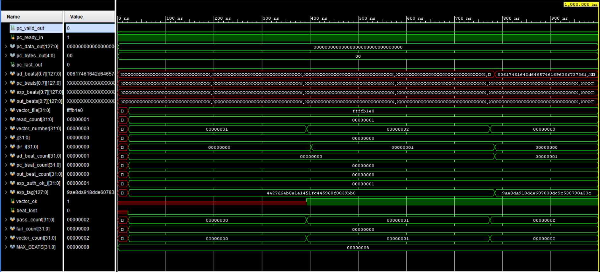
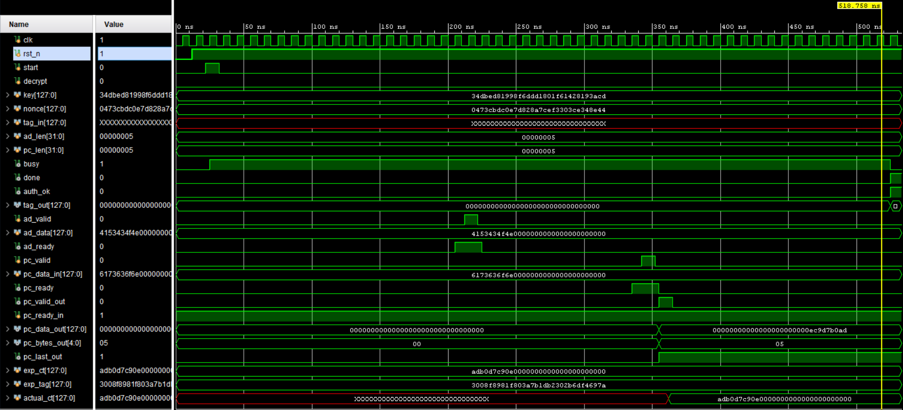

# Schematics & simulation gallery

Synthesized schematics (from the `tools/build_skin.py` + netlistsvg flow,
exported to PDF) and Icarus/waveform-viewer simulation screenshots for
every RTL module, generated while verifying against `vectors/*.vec`
(see [`vectors.md`](vectors.md)). These are reference snapshots checked
in for browsing -- regenerate the schematics locally with the `tools/`
scripts rather than treating these as the source of truth for the design.

`ascon_io_if.v` has neither: it's an unused building block for a future
bus adapter (see [`architecture.md`](architecture.md)), not part of the
verified AEAD datapath.

## Round-constant lookup

[`ascon_round_const_schematic.pdf`](assets/schematics/ascon_round_const_schematic.pdf)

## Per-round layers

| Module | Schematic | Simulation |
|---|---|---|
| `ascon_pC` (constant addition) | [PDF](assets/schematics/ascon_pC_schematic.pdf) |  |
| `ascon_pS` (S-box substitution) | [PDF](assets/schematics/ascon_pS_schematic.pdf) |  |
| `ascon_pL` (linear diffusion) | [PDF](assets/schematics/ascon_pL_schematic.pdf) |  |
| `ascon_round` (pC + pS + pL) | [PDF](assets/schematics/ascon_round_schematic.pdf) |  |

## Permutation core

[`ascon_permutation_schematic.pdf`](assets/schematics/ascon_permutation_schematic.pdf)

## Controller helpers

| Module | Schematic | Simulation |
|---|---|---|
| `ascon_pad` (block padding) | [PDF](assets/schematics/ascon_pad_schematic.pdf) |  |

## Full AEAD controller

[`controller_schematic.pdf`](assets/schematics/controller_schematic.pdf)

Encrypt/decrypt+verify walkthroughs:

A second, single-instance controller configuration was also exercised:

